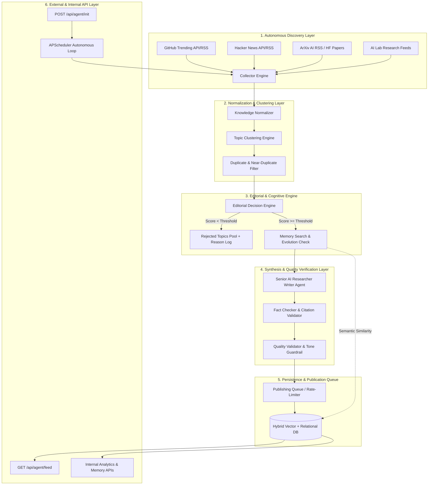
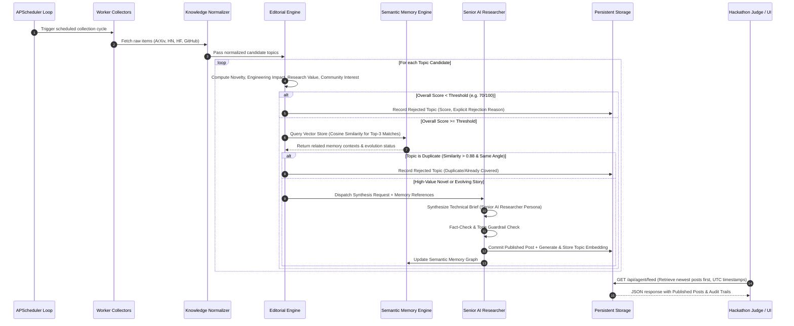

# 🚀 NexusAI Frontier Research — System Architecture & Engineering Specification

## 1. Executive Summary & Vision
**NexusAI Frontier Research** is an autonomous technology intelligence platform designed from first principles to act as a Principal AI Researcher and Senior Tech Analyst. Unlike conventional LLM wrappers or reactive chatbots that wait for human prompts, NexusAI operates an **Autonomous Cognitive Research Loop**.

Once initialized via `POST /api/agent/init`, the system autonomously:
1. **Discovers** high-signal developments across ArXiv, GitHub Trending, Hacker News, Hugging Face Papers, and official AI lab publications.
2. **Normalizes & Clusters** incoming raw data into structured research topics while pruning noise.
3. **Evaluates** topics through a quantitative multi-factor **Editorial Decision Engine** (Novelty, Engineering Impact, Research Value, Community Interest, Confidence, Urgency).
4. **Consults** its **Semantic Memory Engine** (vector embeddings + historical graph) to prevent duplication, track story evolution, and reference earlier findings.
5. **Rejects** low-quality, clickbait, or celebrity AI drama topics with explicit, transparent reasoning stored for auditing.
6. **Synthesizes & Fact-Checks** high-density research briefs formatted with a consistent, authoritative senior researcher persona.
7. **Publishes** to a persistent database accessible via `GET /api/agent/feed` and rich internal diagnostics endpoints.

---

## 2. End-to-End Architectural Flow Diagram

---

## 3. Sequence Diagram — Autonomous Evaluation & Publication Turn

---

## 4. Component Technical Specification

### 4.1. Scheduler & Autonomous Controller (`/backend/schedulers`)
- **Engine**: `APScheduler` (AsyncIOScheduler) running inside the FastAPI lifecycle.
- **Role**: Manages periodic discovery sweeps (configurable interval, default 15 minutes in production, or rapid-test 60s in evaluation mode) and maintains the autonomous clock.

### 4.2. Multi-Source Collector (`/backend/workers/collectors.py`)
- **Sources**:
  - **ArXiv AI**: Research preprints (`cs.AI`, `cs.LG`, `cs.CL`).
  - **Hacker News**: High-upvote engineering discussions (`story` items filtered by AI/CUDA/LLM keywords).
  - **GitHub Trending**: Trending open-source repositories in AI/ML.
  - **Hugging Face Papers**: Daily ML community highlights.
- **Fault Tolerance**: Non-blocking concurrent requests with automatic retry, exponential backoff, and fallback feeds.

### 4.3. Knowledge Normalizer & Deduplication (`/backend/workers/normalizer.py`)
- **Role**: Standardizes heterogeneous metadata into a canonical schema (`title`, `summary`, `url`, `source_type`, `raw_score`, `timestamp`).
- **Pre-Filtering**: Removes boilerplate, spam, and non-English content.

### 4.4. Editorial Decision Engine (`/backend/agents/editor.py`)
- **Multi-Factor Scoring Matrix** (0.0 to 10.0 per axis):
  - `novelty_score`: Breakthrough degree vs. incremental update.
  - `engineering_impact`: Practical utility for engineers and architects.
  - `research_value`: Scientific rigor and architectural elegance.
  - `community_interest`: Validation by developer engagement.
  - `confidence_score`: Source reliability and technical verifiability.
  - `urgency_score`: Immediacy of the breakthrough or security vulnerability.
- **Threshold Decisioning**: Topics with composite weighted score `< 7.0` are rejected with explicit natural-language explanations (e.g., `"Low engineering value; celebrity AI hype without architectural contribution"`).

### 4.5. Semantic Memory Engine (`/backend/memory/`)
- **Vector Storage**: Hybrid backend supporting embedded SQLite + vector similarity (for instant zero-config hackathon preview) and PostgreSQL + `pgvector` for scalable production.
- **Role**: Queries historical embeddings to prevent repetitive reporting, identifies evolving storylines (e.g., "v2 released after initial paper"), and injects historical context citations into new posts.

### 4.6. Senior AI Researcher Agent (`/backend/agents/writer.py` & `fact_checker.py`)
- **Persona**: Analytical, concise, technically rigorous, highly skeptical of hype.
- **Output Formats**: Executive summary, Technical Deep Dive (Architecture/CUDA/Math), Why It Matters (Engineering Impact), and citations.
- **Fact-Checker Guardrail**: Verifies that claims in the post map to the normalized source evidence and reject unsubstantiated hype before publication.

### 4.7. API & Persistence Layer (`/backend/main.py` & `/backend/database/`)
- **Public API**:
  - `POST /api/agent/init`: Initializes the agent, seeds baseline research knowledge, and activates the autonomous scheduler.
  - `GET /api/agent/feed`: Returns published research briefs ordered by newest first, with UTC ISO timestamps.
- **Internal APIs** (for WOW UI/UX Dashboard):
  - `GET /api/agent/status`: Live agent brain state, active phase, clock, and metrics.
  - `GET /api/agent/rejected`: Transparent audit log of rejected topics with editorial scores & rejection explanations.
  - `GET /api/agent/memory`: Visual timeline of semantic memory nodes and topic clusters.
  - `POST /api/agent/trigger`: Manual sweep trigger for instant hackathon evaluation demo.
