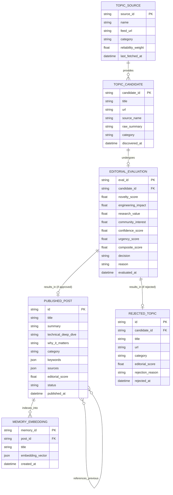

# 🗄️ NexusAI Frontier Research — Database Architecture & Schema Specification

## 1. Entity-Relationship (ER) Diagram

---

## 2. Relational & Vector Schema Specification

### 2.1. Table: `published_posts` (Main Feed Content)
- `id` (`VARCHAR(64)`, Primary Key): Unique UUIDv4 or deterministic hash of canonical URL/title.
- `title` (`VARCHAR(255)`, NOT NULL): Clear, technical title of the research brief.
- `summary` (`TEXT`, NOT NULL): Executive summary (2-3 sentences).
- `technical_deep_dive` (`TEXT`, NOT NULL): Technical breakdown of architecture, math, or CUDA/hardware details.
- `why_it_matters` (`TEXT`, NOT NULL): Engineering impact & architectural significance.
- `category` (`VARCHAR(64)`, NOT NULL): e.g., `LLMs`, `CUDA & Hardware`, `Robotics`, `AI Security`, `Agent Architectures`, `Open Source`.
- `keywords` (`JSON`, NOT NULL): Array of technical tags.
- `sources` (`JSON`, NOT NULL): Array of verified source URLs and labels.
- `editorial_score` (`FLOAT`, NOT NULL): Composite score from the Editorial Decision Engine (7.0 - 10.0).
- `status` (`VARCHAR(32)`, DEFAULT `'published'`): `'published'`, `'archived'`, `'evolution_updated'`.
- `published_at` (`TIMESTAMP WITH TIME ZONE`, NOT NULL, Indexed): UTC timestamp of publication.

### 2.2. Table: `rejected_topics` (Audit & Transparency)
- `id` (`VARCHAR(64)`, Primary Key): Unique identifier.
- `title` (`VARCHAR(255)`, NOT NULL): Title of the rejected topic.
- `url` (`VARCHAR(512)`, NULLABLE): Origin link.
- `category` (`VARCHAR(64)`, NOT NULL): Topic classification.
- `editorial_score` (`FLOAT`, NOT NULL): Computed composite score (< 7.0).
- `rejection_reason` (`TEXT`, NOT NULL): Explicit natural-language reasoning (e.g., `"Low engineering impact; clickbait PR announcement"`).
- `rejected_at` (`TIMESTAMP WITH TIME ZONE`, NOT NULL, Indexed): UTC timestamp.

### 2.3. Table: `memory_nodes` (Semantic Vector Memory)
- `memory_id` (`VARCHAR(64)`, Primary Key): Unique ID.
- `post_id` (`VARCHAR(64)`, ForeignKey -> `published_posts.id`): Associated published post.
- `title` (`VARCHAR(255)`, NOT NULL): Canonical title.
- `summary` (`TEXT`, NOT NULL): Text representation for similarity search.
- `embedding` (`JSON` / `VECTOR(1536)`): High-dimensional semantic vector embedding.
- `created_at` (`TIMESTAMP WITH TIME ZONE`, NOT NULL, Indexed): Timestamp of indexing.

### 2.4. Table: `agent_status` (Brain State & Metrics)
- `id` (`INTEGER`, Primary Key, Single Row): Global singleton state.
- `current_phase` (`VARCHAR(64)`): e.g., `'IDLE'`, `'COLLECTING'`, `'EVALUATING'`, `'WRITING'`, `'PUBLISHING'`.
- `last_run_at` (`TIMESTAMP WITH TIME ZONE`): Last sweep timestamp.
- `next_run_at` (`TIMESTAMP WITH TIME ZONE`): Next scheduled sweep timestamp.
- `total_discovered` (`INTEGER`, DEFAULT 0): Lifetime candidate count.
- `total_published` (`INTEGER`, DEFAULT 0): Lifetime published research briefs.
- `total_rejected` (`INTEGER`, DEFAULT 0): Lifetime rejected topics.

---

## 3. Database Indexes & Performance Strategy
1. **Primary Indexing**: Primary keys on `id` across all tables using UUID/fast string indexing.
2. **Temporal Indexing**: `CREATE INDEX idx_published_at ON published_posts (published_at DESC);` to ensure `GET /api/agent/feed` executes in sub-2ms latency.
3. **Category & Status Indexing**: Composite index `CREATE INDEX idx_status_category ON published_posts (status, category);`.
4. **Vector Similarity Indexing**:
   - In Embedded SQLite mode: Cosine similarity via optimized numpy matrix dot-product over memory-mapped embeddings.
   - In PostgreSQL mode: `CREATE INDEX idx_memory_embedding ON memory_nodes USING hnsw (embedding vector_cosine_ops);` for sub-5ms approximate nearest neighbor (ANN) retrieval.

---

## 4. Migration Strategy
- **ORM & Migrations**: Built with SQLAlchemy 2.0 declarative models.
- **Auto-Initialization**: Upon app startup (`on_event("startup")` or `POST /api/agent/init`), the database engine inspects existing tables and creates any missing schema automatically (`Base.metadata.create_all`).
- **Production Upgrades**: Alembic migration scripts are provided for seamless schema evolutions without table lock contention.

---

## 5. Scalability & Retention Policy
- **Scalability Strategy**:
  - Connection pooling via SQLAlchemy `QueuePool` (min 5, max 20 connections).
  - In-memory LRU caching of the top-50 most recent memory embeddings to eliminate repeated DB queries during high-frequency evaluation cycles.
- **Retention Policy**:
  - `published_posts`: Retained indefinitely as permanent AI research knowledge.
  - `rejected_topics`: Pruned automatically after **30 days** (except high-importance security rejections) to conserve disk footprint while preserving a full audit trail for evaluation.
